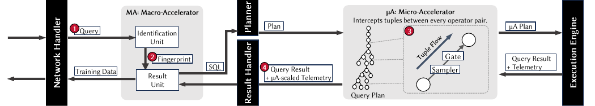
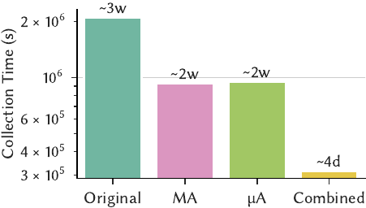
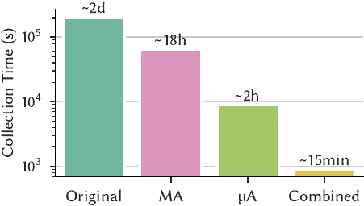
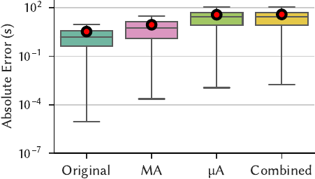
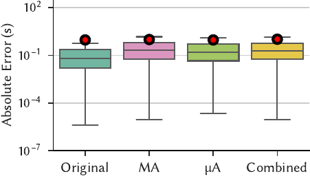

+++
title = "Boot: accelerating training data generation for self-driving database management systems"
date = 2024-04-24

[taxonomies]
areas = ["Systems"]
tags = ["database systems", "training data", "modeling", "database gyms"]

[extra]
author = {name = "Wan Shen Lim", url = "https://cs.cmu.edu/~wanshenl/" }
committee = [
    {name = "Jignesh Patel", url = "https://jigneshpatel.org/"},
    {name = "Phillip Gibbons", url = "https://www.cs.cmu.edu/~gibbons/"},
    {name = "Anup Agarwal", url = "https://108anup.github.io/"},
]
+++

# TL;DR

Background:

1. Optimizing a database management system (DBMS) is difficult; the best configuration
depends on time-varying factors like its environment and workload.
2. Researchers have developed machine learning (ML) models that outperform humans at these tasks.
3. However, the cost (e.g., training time, dollars) of obtaining these models makes them
impractical for establishing an end-to-end database tuning loop.
4. To build these ML models, the DBMS must gather training data by collecting telemetry as it
executes a workload.
5. ML techniques and model training keep getting faster and better. Workload execution has not
changed much, in comparison.
    - Historically, it takes weeks to collect data and weeks to train models -- both processes are
    slow, we just have to accept that models are hard to get.
    - Today, weeks to collect data and minutes to train models -- workload execution is the main
    bottleneck now!

Big idea:

1. Training data collection is slow because the DBMS couples it to workload execution.
2. However, training data collection **does not care about query results**; it fundamentally
differs from workload execution.
3. Take shortcuts during workload execution for faster training data generation!
    - Workloads are repetitive - avoid executing similar queries twice.
    - Operators are repetitive - execute less of an operator if there is enough data.
4. Obtain up to 225x speedups by eliminating repetition at the:
    - Inter-query level (macro-acceleration)
    - Intra-query level (micro-acceleration)
    - At a modest cost to model accuracy, but tuning algorithms are surprisingly robust.

# Introduction

> Database management systems are hard to configure by hand.  
> Machine learning models perform better.
<p></p>

Database management systems (DBMSs) are challenging to optimize correctly because their ideal
configuration depends on their workload, database contents, hardware, and run-time environment,
which all fluctuate over time.
To address this difficulty, researchers have designed methods for automated DBMS configuration, in
[one case](https://ottertune.com/blog/history-ottertune-research-part1) obtaining 20% more
performance than the most skilled human.

The unifying goal of such research is to develop a
[_self-driving_ DBMS](https://db.cs.cmu.edu/papers/2017/p42-pavlo-cidr17.pdf)
that configures, tunes, and optimizes itself automatically.
Given a target objective function (e.g., latency, throughput, cost), a self-driving DBMS aims to
find the best configuration for its objective autonomously.
It [achieves this](https://db.cs.cmu.edu/papers/2021/p3211-pavlo.pdf)
by relying on machine learning (ML) models that predict its run-time behavior under
different configurations.
Such models allow the DBMS to evaluate whether a candidate configuration is beneficial without
executing the queries in its workload, which would be too expensive.
For example, the DBMS may need hours to complete a computationally intensive SQL query.
If the DBMS only needs the query's run-time, it can achieve significant time savings by using a ML
model to predict the query's latency instead of running it.

To build its ML models, the DBMS collects
[_training data_](https://db.cs.cmu.edu/papers/2022/moddm074-butrovich.pdf)
comprised of database metadata (e.g., optimizer statistics) and run-time telemetry
(e.g., the latency of an operator in its query plan).
It generates this data by observing itself as it executes a
[representative workload](https://db.cs.cmu.edu/papers/2018/mod435-maA.pdf),
such as an application trace of SQL queries.
It then constructs its models by applying ML
[techniques](https://db.cs.cmu.edu/papers/2021/ma-sigmod2021.pdf).

> Obtaining training data for ML models is expensive.  
> Especially when training data collection is not a one-time cost.
<p></p>

However, the high cost of obtaining these models makes them impractical for real-world deployments.
In the past, the primary contributors to this cost were training data collection and model
building (_collection time_ and _training time_, respectively).
But although ML techniques continue to improve and model construction becomes faster, training data
collection speeds have largely remained the same.
Today, the ratio of collection time to training time is over 99% (e.g., weeks to collect data,
minutes to train models).  
**Problem 1: Training data is expensive to collect!**

Furthermore, unlike other ML domains that dismiss training data collection as a one-time cost
(e.g., LLM researchers share model weights because their training data does not change as much),
an autonomous DBMS needs training data
[specific to its workload and configuration](https://db.cs.cmu.edu/papers/2023/p27-lim.pdf).
Reusing models from other deployments is challenging because the database's contents, hardware,
and system configuration influence its training data labels.
For example, the speed at which the DBMS's sequential scan operator reads tuples from disk depends
on its hardware and configured buffer pool size.
Additionally, even if the DBMS already has models, they are often invalidated because of workload
drift, schema changes, dataset growth, and more.  
**Problem 2: Training data is difficult to reuse!**

Consequently, an autonomous DBMS must regularly collect training data from scratch to maintain
its ML models.
Due to the high cost and frequency of training data generation, it often spends more time
collecting training data than improving its configuration.

# Insight

## Decoupling

> Training data generation is slow because it is coupled to regular query execution.  
> This coupling is unnecessary, so we can obtain the same amount of training data much faster.
<p></p>

Training data generation is slow because it builds off the DBMS's regular query execution.
To execute a SQL query, the DBMS uses its internal statistics to search for a _query plan_ that
efficiently computes the query's answer.
A query plan is a tree composed of the DBMS's _operators_ (e.g., sequential scans read a table
from disk, hash joins combine the output of their children).
The DBMS executes the query plan by sending all _tuples_ (i.e., rows of data) from the children
nodes to their parent nodes, which computes the query's result.

But training data generation differs from regular query execution because it concerns telemetry
(e.g., timing information), not results (i.e., the tuples returned from a SQL query).
A DBMS **does not need accurate query results** during this process.
Therefore, it can accelerate its training data production if it can infer a workload's telemetry
without executing the workload to completion.
This inference is possible because a DBMS's workload is repetitive at the query and operator level.

## Query Repetition

> For most workloads, the DBMS executes the same query template repeatedly.  
> Many of those executions are redundant for training data generation.
<p></p>

Most accesses to a DBMS are [programmatic](https://db.cs.cmu.edu/papers/2018/mod435-maA.pdf).
Software (e.g., dashboards, reporting tools, web applications) generates most SQL queries
from similar _query templates_, differing only in their input parameters.
A query template is a normalized SQL string with its constants removed. For example,  

&nbsp;&nbsp;&nbsp;&nbsp;Query: _SELECT name FROM pets WHERE kind = 'dog' and name = 'terrier'_  
&nbsp;&nbsp;&nbsp;&nbsp;Template: _SELECT name FROM pets WHERE kind = '$1' and name = '$2'_  

Given the same template, a DBMS often generates an identical query plan; some DBMSs even cache
query plans by their corresponding template.
That is, they reuse the same query plan for different instantiations of a query template, leading
to repetition in query execution.

| Workload   | \# Queries   | \# Templates | Repetition |
|:----------:|:------------:|:------------:|:----------:|
| Admissions |        2564M |         4060 |     627k X |
| BusTracker |        1223M |          334 |    3.66M X |
| MOOC       |          95M |          885 |     107k X |
| TPC-H      |        20000 |           22 |      909 X |
| DSB        |        11440 |           52 |      220 X |
| Stack      |         5000 |           25 |      200 X |

<p style="text-align: left;">
<b>Table 1, Query Repetition:</b>
<em>
The number of queries and query templates in the workloads used in recent ML approaches for
database tuning.
</em></p>

We observe that both real-world application traces and synthetic benchmarks exhibit high
repetition -- the DBMS executes a small number of query templates hundreds, thousands, or even
millions of times.
This repetition is necessary during regular query execution because the DBMS must return
accurate results.
However, during training data generation, eliminating this repetition is an opportunity to achieve
significant speedups.

What is needed is a way to determine _when_ and _why_ the DBMS should execute a query again so that
it can execute fewer queries during training data generation.
For the purpose of obtaining training data for its ML models,
it should skip all queries that do not contribute valuable training data
(i.e., exhibit new behavior).
The DBMS should only re-execute a query if it produces substantially different telemetry (e.g.,
run-time) from its past parameterizations.

## Operator Repetition

> Across all queries, the DBMS only uses a small number of operators.  
> If a query is slow, skip the expensive operators -- they already appear elsewhere.
<p></p>

For every unskipped query that the DBMS must execute, there remain opportunities to identify
and eliminate redundancies in its query plan.
Recall that a query plan is composed of a DBMS's operators.
However, because a typical DBMS has only a few dozen to a hundred operators, the repetition in
observing a particular operator's behavior is even more frequent than that of entire queries in
Table 1.
Eliminating this repetition is especially important when the DBMS is exploring new configurations
that turn out to be bad, causing queries to take a long time to complete.
For example, a query that runs slowly because of missing indexes will remain slow for the rest of
its execution.
Yet the importance of that particular query to the training data corpus
is minimal because it spends most of its time performing disk reads in its highly predictable
sequential scan operators.
Hence, it is essential to reduce the time the DBMS spends executing operators after they
have become predictable.

The reason this is possible is that operators are independent of each other; a DBMS operator's
behavior depends only on its input tuple(s).
Existing research relies on this independence to build ML models for the DBMS.
Our key insight is that integrating such modeling assumptions earlier into the training data
generation process enables early termination in query execution.

## Aside: The Need for Models

Exploiting repetition allows us to obtain cheap training data for the DBMS's models,
but such techniques may not be suitable for replacing the models themselves
(e.g., directly running accelerated queries during database tuning).

We aim to build _bootstrap_ models, which are fast and cheap but not necessarily as precise.
These models allow the DBMS to begin its tuning loop.
However, as that happens, the DBMS can spend more compute to build more complex models (e.g.,
[hierarchical models](https://arxiv.org/abs/2403.02286)) on the same training data.
The higher precision of these complex models can improve the quality of its tuning recommendations.

Additionally, most models only require query plans as an input.
They do not require the DBMS to be running on the same machine.
This allows the DBMS to deploy and parallelize its tuning algorithms across different machines
(e.g., with GPUs for faster inference) without paying the high cost of provisioning separate copies
of the DBMS's hardware and data.

Because keeping modeling as a separate step in the tuning pipeline confers various benefits,
we limit our scope to collecting training training data faster.

# Solution

To summarize the discussion above:

- The DBMS generates training data by executing queries.
- Executing queries is a bottleneck for ML-based DBMS automation.
- Because training data does not need to compute exact query results, the DBMS can skip or
accelerate query execution by exploiting repetition to synthesize training data.

## Architecture

Given this, we present the Boot framework to accelerate training data generation.
Boot is transparent to the DBMS's upstream ML components and leverages workload repetition in two
ways to expedite training data collection while minimizing its impact on the accuracy of the ML
models.
First, Boot reduces the number of queries the DBMS executes by recognizing redundant queries
based on their high-level semantics, avoiding re-execution through reusing previously computed
training data (_macro-acceleration_).
Next, for the queries that the DBMS does execute, Boot modifies their run-time execution behavior
by injecting special operators into their query plans.
These operators (1) dynamically identify redundant computations and then (2) intelligently
short-circuit parts of the plan to expedite their completion (_micro-acceleration_).


<p style="text-align: left;">
<b>Figure 1, Architecture:</b>
<em>
An overview of Boot's internal modules and execution flow.
The Macro-Accelerator (MA) decides whether to execute a query, and the
Micro-Accelerator (µA) accelerates the execution of a specific query.
</em></p>

<style>
.step {
    border-radius: 50%;
    width: 1.5em;
    height: 1.5em;

    background: #fff;
    border: 2px solid #000000;
    color: #FFFFFF !important;
    background-color: #C41230;

    pointer-events: none;

    display: inline-block;
    text-align: center;
}
</style>

As Fig 1 shows, Boot integrates into a DBMS using two modules:

1. The __Macro-Accelerator__ (MA) sits between the DBMS's network handler and planner,
2. The __Micro-Accelerator__ (µA) embeds itself in the DBMS's execution engine.

Boot's design does not modify the DBMS's interface for training data generation.
Clients still connect to a Boot-enhanced DBMS over standard APIs (e.g., JDBC, ODBC) to execute
their workloads and collect training data.
This compatibility allows Boot to drop into existing modeling pipelines without any code change;
the only effect is that the DBMS produces training data faster.
However, because Boot alters the DBMS's regular query execution semantics, it is
[fundamentally unsuitable](https://www.cidrdb.org/cidr2023/papers/p27-lim.pdf)
for production environments.
Therefore, we deploy Boot on an offline clone of the production DBMS to avoid application errors.

```SQL
SELECT nation, o_year, SUM(amount) as sum_profit
  FROM (
  SELECT n_name as nation, EXTRACT(YEAR FROM o_orderdate) AS o_year,
         l_extendedprice*(1-l_discount)-ps_supplycost*l_quantity AS amount
    FROM part, supplier, lineitem, partsupp, orders, nation
   WHERE s_suppkey = l_suppkey AND ps_suppkey = l_suppkey
     AND ps_partkey = l_partkey AND p_partkey = l_partkey
     AND o_orderkey = l_orderkey AND s_nationkey = n_nationkey
     AND p_name LIKE '%[COLOR]%'
) AS profit GROUP BY nation,o_year ORDER BY nation, o_year DESC;
```
<p style="text-align: center;">
<b>Listing 1:</b>
<em>TPC-H Q9.</em>
</p>

We now provide an overview of Boot's macro- and micro-accelerators using the TPC-H Q9 query shown
in Listing 1 as a running example. Executing 1000 iterations of Q9
(with different strings substituted for `%COLOR%`) at scale-factor (SF) 100 on
PostgreSQL (v15) takes 17 hours. Enabling Boot reduces the time required to 1 minute with minor
degradation in ML model accuracy. We omit technical details for brevity and present only the
high-level intuition in this blog post; we encourage interested readers to check out our paper.

## Macro-Accelerator

Boot's Macro-Accelerator (MA) module inspects each query request as it arrives to determine whether
it should be executed again (i.e., whether executing it would increase the diversity of the
training data gathered thus far).

> Macro-Accelerator = (1) Similarity + (2) Adaptivity  
> (1) _Fingerprinting_ identifies similar queries  
> (2) _Exponential skipping_ decides whether to re-execute queries
<p></p>

Figure 1 shows that <a class="step">1</a> when a SQL query arrives,
the MA fingerprints it and checks whether it has executed the query before.
This fingerprint is computed on raw SQL strings because the MA is placed before query planning
to avoid the overhead of planning unnecessary queries.
A simple example of a fingerprint is for the MA to remove the SQL string's constants, producing a
query template.
In the Q9 example above, the MA replaces the '%[COLOR]%' in the string with a placeholder.
More complex schemes for fingerprinting may incorporate a query's parametric behavior or the DBMS's
current configuration to increase the quality of the training data, which we elaborate on in the
paper.

Next, <a class="step">2</a> the MA looks up the query's fingerprint in its _result cache_ to
determine whether the DBMS recently executed a similar query.
This cache maps each fingerprint to a record containing (1) the query's output and (2) the
telemetry produced by the DBMS while executing the query.
The former is necessary because existing workload replay and benchmarking tools assume the
DBMS returns query results with a particular schema (e.g., JSON-formatted plans).
After performing the lookup,

- If the cache does not contain a matching fingerprint, the Boot framework forwards the request
for the DBMS's processing as usual.
- However, if the MA's cache contains a match, it then decides whether to skip the query.
    - To skip the query, it returns the cached result and records that it skipped.
    - To execute the query, it again forwards the request to the DBMS for processing.

We now sketch a brief overview of the MA's policies for skipping query re-execution, leaving
the technical details to our paper.
The high-level idea is similar to exponential backoff, which we now describe as _exponential
skipping_.
Each time the DBMS executes a query, the MA analyzes its resulting telemetry to see whether the
run-time falls within two standard deviations of the fingerprint's historical mean.

- If so, the latest query instance is considered similar. The MA exponentially increases the
number of times to skip this fingerprint until the subsequent execution.
- Otherwise, the skipping algorithm resets. The MA clears the corresponding cache entry.

For example, suppose that Q9 always takes a median run-time of 65 seconds and that the MA skips
queries up to a threshold of 100 times.
The number of times that the MA skips Q9 in between executions is given by the sequence
`[1, 2, 4, 8, 16, 32, 64, 100, 100, ... ]`, dropping the time required for 1000 executions of Q9
from 17 hours to 16 minutes.
However, should a Q9 invocation exhibit new behavior, the skipping sequence is reset to sample
future instances more frequently.
The choice of run-time as a metric is an optimization to avoid storing and comparing against all
executed plans, allowing the MA to maintain only approximately 10 KB of state
(e.g., run-time, number of input rows per operator)
per query template.
As Table 1 shows, a workload typically contains up to a few thousand query templates, so the total
storage overhead of MA is only in the tens of MBs.

## Micro-Accelerator

> Micro-Accelerator = (1) Modifying Tuple Flows + (2) Sampling + (3) Scaling  
> (1) When the flow of tuples stabilizes, the operator is predictable  
> (2) An operator's output induces more work, so sample to control the work generated  
> (3) When stopping an operator early, scale up its telemetry to prevent underestimation
<p></p>

Each query that the MA module does not skip then goes to the DBMS's query planner.
The Boot's Micro-Accelerator (µA) injects its special operators into the query plan at this stage.
These injected components wrap a plan's operators for the µA to monitor their run-time execution
constantly.
When the µA detects that an operator's behavior has stabilized (i.e., more training data
from that operator is unnecessary), it sends a message to the corresponding wrapper to alter
the operator's tuple processing behavior (e.g., reduce the amount of output produced).

The core idea that the µA's injection exploits is that the DBMS performs query processing at the
granularity of its operators.
For example, the
[Volcano model](https://15445.courses.cs.cmu.edu/spring2023/notes/12-queryexecution1.pdf)
requires every operator to implement a _Next()_ function that returns its next tuple.
Therefore, to support µA's injection, the DBMS only needs to provide a way to wrap the tuple
production function (e.g., by replacing an operator's _Next()_ function pointer), either at a
source-code level or through
[extensibility hooks](https://archive.fosdem.org/2021/schedule/event/postgresql_extensibility/).
Because most DBMSs have existing code paths that provide such functionality for
[instrumentation](https://www.postgresql.org/docs/current/sql-explain.html),
implementing µA's injection is relatively straightforward.

Figure 1 shows that <a class="step">3</a> the µA encapsulates each of the DBMS's physical
plan operators (e.g., scans, joins) with a special wrapper operator to control its run-time
behavior dynamically.
For example, this wrapper can sample the wrapped operator's output to emit only 10\% of the tuples
that it would otherwise produce.
It can also terminate an operator's execution early when the µA detects it should do so,
stopping the operator from creating additional work.

Since µA may short-circuit an operator's execution, <a class="step">4</a> Boot scales each
operator's telemetry to approximate the telemetry of its full execution.
For example, a scan operator that processes only 10\% of its expected rows may have its measured
timings scaled ten-fold.
This scaling improves ML model accuracy as it guards against underpredicting query execution times.

The key advantage of µA's wrapper-based approach that directly modifies a physical query plan is
that the DBMS is guaranteed to generate the same plan with and without Boot enabled.
Some DBMSs alter the query plan when using other sampling techniques (e.g., SQL-level
_TABLESAMPLE_), producing plans that differ in shape and performance characteristics.
Because the DBMS is collecting training data to build models of its behavior, the training plans
must resemble an actual deployment's plans as much as possible.

Lastly, after the DBMS executes the µA-wrapped plan, it forwards the query result and telemetry to
the MA module.
The MA module stores this information in its result cache for future invocations of similar
queries.
Boot's MA and µA modules are independent: if either component is disabled, the DBMS will
process data with its regular non-accelerated components instead.
However, they enhance each other's ability to accelerate workload execution.
In the paper, we show that the combined effect of both accelerators obtains up to 225x speedup.

# Results

We highlight a few key results on a "standard" benchmarking setup for PostgreSQL (v15), that is:

- Benchmark 1: [TPC-H](https://www.tpc.org/tpch/), scale factor 100
    - Represents a workload with uniform data distribution.
- Benchmark 2: [DSB](https://aka.ms/dsb/), scale factor 10
    - Represents a workload with complex data distributions, join patterns, and skew.
- Modeling technique: [AutoGluon](https://github.com/autogluon/autogluon)
    - AutoGluon automatically searches over hyperparameters and techniques (e.g., gradient-boosted
    trees, random forests, linear models, neural networks) that existing work uses to build models.
    - We found that AutoGluon is competitive with (and often outperforms) hand-crafted models from
    prior work.

In this blog post, we compare four configurations:

1. the default DBMS without Boot enabled (__Original__),
2. the DBMS with only Boot's macro-accelerator active (__MA__),
3. the DBMS with only Boot's micro-accelerator active (__µA__),
4. the DBMS with both of Boot's accelerators active (__Combined__).

The full paper contains other scenarios, sensitivity analyses, and comparisons to different
techniques.

## Collection Time

> Boot achieves up to 225x speedup on the examples in this blog post.  
> The general scale of its improvement is improving collection time from weeks to days.
<p></p>

We first measure the _collection time_ as previously defined; that is, the time the DBMS
takes to generate training data by executing the workload.

<table style="pointer-events: none; box-shadow: none">
<tr>
  <td style="border: none"></img></td>
  <td style="border: none"></img></td>
</tr>
<tr>
  <td style="border: none; padding: 0"><p style="text-align: center;">Figure 2a: TPC-H</p></td>
  <td style="border: none; padding: 0"><p style="text-align: center;">Figure 2b: DSB</p></td>
</tr>
<tr>
  <td style="border: none; padding: 0" colspan="2">
    <b>Figure 2, Collection Time:</b>
    <em>
    The time to generate training data with different modules of Boot active (lower is better).
    </em>
  </td>
</tr>
</table>

Figure 2 shows the following:

- MA obtains speedups of 2.26x on TPC-H and 3.14x on DSB.
- µA obtains speedups of 2.22x on TPC-H and 23.2x on DSB.
- Combined obtains speedups of 6.64x on TPC-H and 225x on DSB.

We describe a broader range of speedups across different scale factors in the paper, with Boot
generally performing better as the dataset size grows.
The takeaway is that Boot reduces collection time from weeks to days, or from days to hours.
This acceleration is significant because it allows an autonomous DBMS to obtain its ML models in a
fraction of the time, minimizing the time it spends without autonomous capabilities.

We also observe from Figure 2 that:

- The MA and µA obtain different speedups depending on the workload's complexity and skew.
  We analyze speedup sources in the paper and only provide a summary here.
    - The MA executes exponentially fewer queries.
    On a histogram of query runtimes, enabling the MA maintains the overall shape but decreases
    each bar's height significantly (i.e., fewer query invocations) because of exponential
    skipping.
    - The µA executes the same number of queries but accelerates individual queries by reducing the
    time spent in individual operators.
    A bar chart of individual operator timings shows that the µA achieves up to 209x speedup on
    physical operators such as index scans, sequential scans, and hash joins.
    These speedups are from reducing the number of expensive disk operations and tuples processed.
- The MA and µA achieve higher speedups together than they do individually.
    - In the paper, we show that this effect is most pronounced on queries that are long-running or
    have instances which time out.

## Absolute Error

> Boot results in models with comparable mean absolute error.  
> Tuning methods are surprisingly robust to high errors.
<p></p>

We next evaluate the absolute error; that is, the absolute difference between a query's actual
latency and the corresponding model's predicted latency. We also measure the mean absolute error
(MAE). We visualize the absolute error across all predictions as a boxplot.

<table style="pointer-events: none; box-shadow: none">
<tr>
  <td style="border: none"></img></td>
  <td style="border: none"></img></td>
</tr>
<tr>
  <td style="border: none; padding: 0"><p style="text-align: center;">Figure 3a: TPC-H</p></td>
  <td style="border: none; padding: 0"><p style="text-align: center;">Figure 3b: DSB</p></td>
</tr>
<tr>
  <td style="border: none; padding: 0" colspan="2">
    <b>Figure 3, Absolute Error:</b>
    <em>
    The absolute error of models that are trained on the individual datasets (lower is better).
    The red circle shows sample mean and the whiskers extend to 1.5 interquartile range.
    </em>
  </td>
</tr>
</table>

Figure 3 shows that compared to the MAE of the Original configuration's models:

- MA's MAE is 2.64x on TPC-H and 1.06x on DSB.
- µA's MAE is 11.0x on TPC-H and 0.999x on DSB.
- Combined's MAE is 11.5x on TPC-H and 1.11x on DSB.

Intuitively, these results make sense.

- The MA introduces less error because it produces telemetry under similar conditions.
  It only decides whether to execute a query and does not modify query execution itself.
- The µA results in more error because it (1) terminates execution early and (2) scales the
telemetry.
- The Combined configuration generally has the worst of both errors.

To contextualize these results, we present a scenario from the paper in which we summed the
prediction error for all invocations of TPC-H's Q1.

- Invoking Q1 for 1000 iterations took 3.7 hours.
- The Original models are off by 308 seconds (5 minutes), whereas the Combined models are off by
  2099 seconds (35 minutes).
    - The Combined models have a 7x more error. However, they only required four days of
    training data generation, whereas the Original models required three weeks.
    - The final prediction of the Combined models, 3.1 hours when the actual time was 3.7 hours,
    remains accurate enough to be useful.

At this stage, a natural question is how bad the errors can get before the models are no
longer usable.
[Recent work](https://www.vldb.org/pvldb/vol17/p823-zhao.pdf)
shows that even models with terrible errors (e.g., 10x, 50x) have comparable
[F1 scores](https://en.wikipedia.org/wiki/F-score) for the task of index recommendation.
We started our investigation into this line of research after making similar observations in
internal experiments; intuitively, for many tuning tasks, all that matters is getting the
"direction" of tuning right.

# Conclusion

Researchers have developed effective ML models for database tuning, but integrating these models
into an end-to-end tuning loop is challenging because their construction requires an expensive and
lengthy training data generation process.
We introduce two acceleration techniques to expedite training data collection by leveraging the
unique characteristics of the training data environment; unlike regular query execution, there is
no need for the DBMS to compute accurate results.
We integrate these techniques into our framework Boot that drops into existing modeling pipelines.
Boot's sharp reduction in training data collection time makes it well-suited for bootstrapping an
autonomous DBMS's initial models, minimizing the time spent without self-tuning capabilities.

Our paper is under submission.

